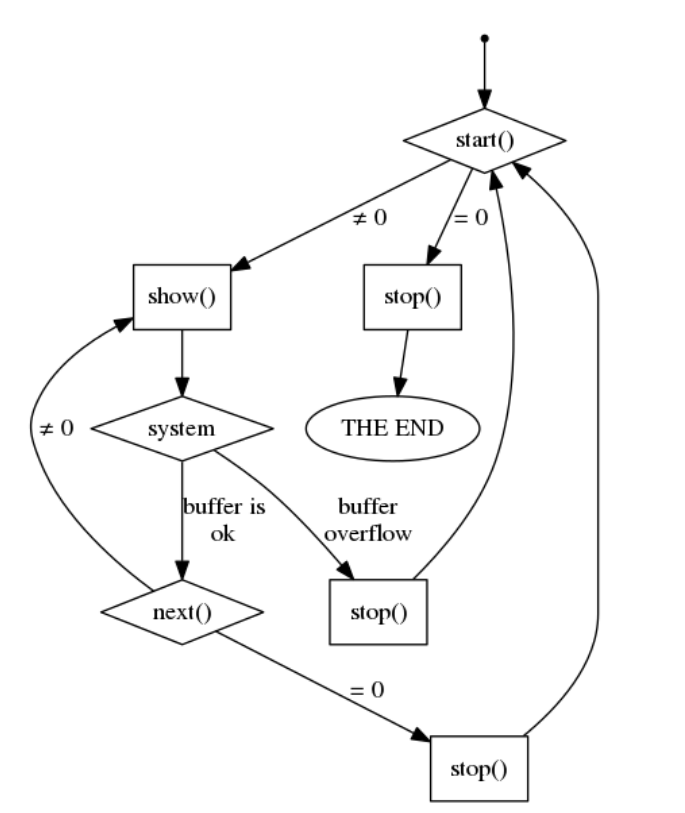

# Вопросы на сдаче

## Обычные фортунки

### Сколько точек входа в программе?

6

### Какие?

1. init
2. exit
3. open
4. release
5. read
6. write

### Когда вызываются open и release?

При каждом чтении и записи для открытия и закрытия файла. `open` до
чтения/записи, `release` -- после.

### Почему мы не можем использовать стандартные функции? 
### Почему мы должны использовать специальные функции?

> Это два вопроса, на которые один ответ

Так как ядро оперирует физическими адресами, а процессы используют виртуальное
адресное пространство.

> Сказала, что процессы оперируют виртуальными адресами. Мне сказали, что они не
> могут ими оперировать. Поэтому сказала примерно так, как выше.

### В чем недостаток виртуальных адресов?

~~Процесс обращается к странице (данным, которыми являются и данные и
код)~~ Когда ядро обращается к буферу пользователя, страницы с ним может не быть
в памяти. Если страницы нет в памяти, то возникает страничное прерывание, в
результате которого страница будет загружена в физическую память.

### Покажите, что Вы создали файл, директорию, символическую ссылку.

Команда (для реализации из данного репозитория).

```
ls -ail /proc | grep fortune
```

Результат:

```
4026532476 dr-xr-xr-x   2 root root  0 Apr 10 13:16 fortuneDir
4026532478 -rw-rw-rw-   1 root root  0 Apr 10 13:16 fortuneFile
4026532479 lrwxrwxrwx   1 root root 10 Apr 10 13:16 fortuneLink -> fortuneDir
```

Столбцы (вот они слева направо):

* inode;
* тип файла + права доступа;
* количество ссылок
* имя владельца;
* имя группы владельца;
* размер;
* дата/время последней модификации
* имя файла.

## Фортунки через seqfiles

### Сколько точек входа в программе?

Вообще, судя по логу, их 10, при условии, что мы переписали read, сделав вывод и
вызов стандартной функции read для seqfiles (в логе перед каждым вызовом
start будет вызов read). Но так как многие этого не делали, то правильным
ответом было число 9.

Если считать, что 10, то это точки:

* init
* exit
* open
* release
* write
* read `???`
* start
* show
* next
* stop

### Когда вызывается stop?

Когда start, show или next возвращает `NULL`.

Или из методички:

Наиболее запутывающим выглядит использование функции stop, которая может
вызываться в трёх разных контекстах. Её вызов после start означает окончание
работы по распечатке данных. Её вызов после show означает, что при выполнении
последней операции печати в буфер (обычно для этого используется функция
seq\_printf) случилось переполнение страничного буфера и эта операция печати была
отменена. А её вызов после next – это самый интересный случай, который
происходит, когда заканчивается печать в буфер одних данных и нужно либо
завершать работу, либо использовать новые данные.




> Фортунки сданы ✅

> Успехов ✊
