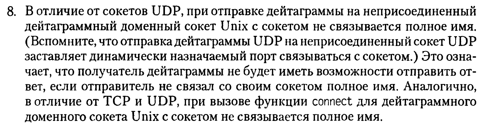

# Вопросы при защите

> По первой части просто код посмотрели

> Но могли потребовать сделать без bind на стороне клиента...

Кажется, это невозможно, по крайней мере так пишет Стивенс:

> У. Р. Стивенс и др. UNIX Разработка сетевых приложения. 3-е изд. c. 449

В таком случае некоторые сдавали не перекомпилированную программу.

> Бывает ¯\\\_(ツ)\_/¯

Если у кого-то получится, сообщите, мне интересно :)

По второй части стандартные вопросы, которые могут задать и по первой (не все,
конечно)

## Перечислите порядок действий на стороне сервера

Перечисляем по коду системные вызовы (и не только) с аргументами

`socket` -- создает сокет, возвращает файловый дескриптор

Заполнение полей структуры `sockaddr_in` (для сетевых), `sockaddr_un` (для
доменных).

### Что означает константа INADDR_ANY?

Ответ из методы (не подходит для защиты): благодаря этой константе наша
программа сервер зарегистрируется на всех адресах той машины, на которой она
выполняется.

> Я сказала то, что выше, мне сказали что-то похожее на то, что ниже

Правильный ответ: с помощью этой константы на отдельно стоящей машине
производится работа, как в распределенной системе, то есть нам не важно, какой
адрес у сервера (или что-то в этом духе, после "то есть" лучше не говорить,
слово "имитировать" не использовать)

### Что такое файл?

> Да, и такое бывает, если неудачно окажешься после человека, сдающего VFS ;)

Файл -- любая поименованная совокупность данных, хранящаяся во вторичной памяти

### Какая основная задача файлов/вторичной памяти?

Сохранение информации после завершения работы компьютера/долговременное хранение
информации/вторичная память -- энергонезависимая.

`bind` -- связывает сокет с адресом.

Дальше меня не спросили, можно по методе.

## Какой мультиплексор используете?

poll

## Что использует poll?

Массив сокетов

## Зачем используем мультиплексирование?

Время блокировки при ожидании на наборе сокетов (то есть при ожидании события на
любом сокете) меньше времени блокировки при ожидании сокетов в каком-либо
конкретном порядке (то есть при ожидании события на каком-либо конкретном
сокете).

## Чем мультиплексирование лучше, например, использования fork?

При fork увеличивается количество процессов (на обработку сообщений каждого
клиента свой процесс), сдедовательно неэффективно используются ресурсы системы.

> Кажется, сокеты сданы ✅

> Успехов ✊
